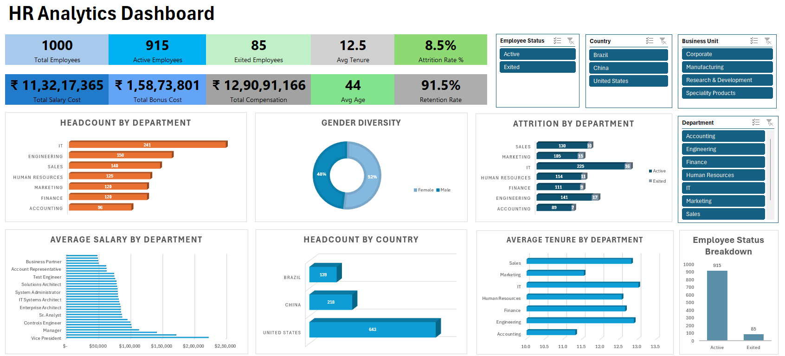

# HR Analytics Dashboard (Excel)

## 📊 Overview
This project presents an interactive HR analytics dashboard built in Excel to analyze a dataset of 1000 employee records and identify key workforce trends, attrition patterns, and department-level insights.

## 🎯 Objective
To transform raw HR data into meaningful business insights and support decision-making related to employee retention, compensation, and workforce distribution.

## 🚀 Key Insights
- Total Employees: 1000  
- Active Employees: 915  
- Attrition Rate: 8.5%  
- Average Tenure: 12.5 years  
- Average Age: 44 years  

## 📈 Features
- KPI Cards displaying key HR metrics (Employees, Attrition, Compensation)  
- Department-wise headcount and attrition analysis  
- Gender diversity visualization  
- Salary distribution across roles  
- Country-wise employee distribution  
- Average tenure analysis by department  
- Interactive slicers (Department, Country, Business Unit, Employee Status)  

## 🛠 Tools & Skills Used
- Microsoft Excel  
- Pivot Tables  
- Charts & Data Visualization  
- Slicers for interactivity  
- Data Cleaning & Transformation  

## 📁 File Structure
- Raw_Data: Original employee dataset  
- Pivot_Analysis: Intermediate analysis using pivot tables  
- Dashboard: Final interactive dashboard  

## 📷 Dashboard Preview

## 📥 Download File
[Download Excel Dashboard](HR_Analytics_Dashboard.xlsx)

## 💡 Conclusion
This dashboard enables HR teams to monitor workforce trends, analyze attrition patterns, and make data-driven decisions to improve employee retention and organizational planning.
